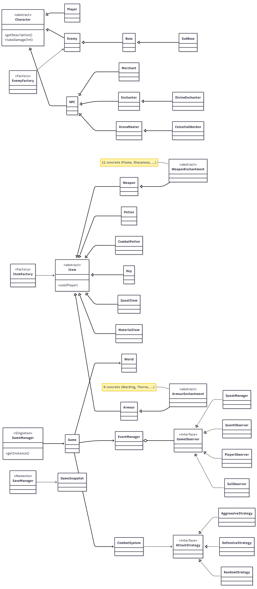

# CS1OP — Object Oriented Programming
## Assignment Report: Project

---

**Module Code:** CS1OP  
**Assignment Title:** CS1OP-TextGame
**Student Number:**  34009217
**Actual Hours Spent:**  50
**AI Tools Used:** ChatGPT (OpenAI), Claude Code (Anthropic)  
**Repository URL:** https://csgitlab.reading.ac.uk/ln009217/cs1op-textgame  

--- 

**Introduction** 
This game, The Fallen Kingdom, is a text-based RPG that makes you find an ancient relic and explore and go through the world, getting stronger gear to take down the Shadow Lord. This is done through a set of two whole maps, over 10 interactable NPCs, twelve different enemies and a huge selection of enchantments and items that you can use to have a new and unique playthrough every time you try to play the game. 

This project has been used to show the key principles of object-oriented programming, demonstrating features like inheritance, abstraction, polymorphism and software design patterns that have been established for decades, and trying to implement these to make a well-functioning and enjoyable game. It uses a text-based core and a Swing window to bring everything together, with a full exploration function for travelling through an entire map and completing quests, a whole separate area for the map, and a dedicated fighting scene for combat with enemies to give a refreshing feel to the game. There is even an economy system with buying, selling and stocking, along with data saving for loading up file saves if the game is downloaded. A full inventory system with item enchanting adds new stats and perks, making every equipment loadout almost guaranteed to be unique across hundreds of combinations, and a plethora of puzzles and riddles add more flair to the game.

---

**AI Support in Development**
When creating this game, to meet deadlines and overcome some unthinkable challenges, I used AI throughout the coursework to help keep my workflow fast and continuous, as well as to help me come up with new ideas when I was struggling for more, or when tweaking and fixing the game. 

I used both ChatGPT and Claude Code within my terminal, with ChatGPT creating the baseline idea and storyline as well as the artwork used for the enemies, and Claude Code being used to assist me throughout my programming journey.

There are a lot of tasks that are simple but time-consuming and hard to manage whilst creating a project like this, especially on a scale as grand as mine. I honestly was going to keep it a fairly simple game at first, and it was extremely simple to begin with — only around four locations and a handful of items and enemies. This eventually turned into the monster project it has become, with a lot more depth than I ever planned initially, and this was purely out of passion and fun. AI was used plenty to make sure I could do this on time. There is a lot of repetitive scaffolding code that is annoying to type out but easy to understand, which AI could do instantly for me. As another example, when figuring out an idea for a new enemy and adding it in, Claude could easily implement the new character into my existing enemy factory, which made developing the game so much faster. When I got stuck with things like stats and keeping things balanced, I could also use Claude to help me figure these hurdles out. Within EventManager it is actually noted that Claude AI was used to assist the work, as it helped create the Observer pattern — a clear example of AI properly helping my workflow and showing how I was able to execute the game properly, and it is documented directly in the file.

A huge benefit of AI was getting repetitive but necessary code done quickly and almost exactly as I needed, without it straying far from what I asked. Another advantage of Claude running within the terminal is that I could have it restructure a file — like the world file when adding new locations — while I worked on something else. Running it in parallel with my own coding essentially gave me a second set of super-intelligent hands, which was very efficient.

There were drawbacks, however, when making this project. There were points where I would tell it to do things and it would go back on what I wanted, do its own interpretation, or sometimes not really change anything. I used it to help balance stats for my game when I realised that, very quickly, starter gear could become strong enough to beat the whole game, which meant the enemies were far too weak. So I thought of some ideas for stats for the new enemies and asked Claude to give me its interpretation, and it gave me a great set of stats for every enemy that I liked. However, when it tried implementing them without telling me, it just started mixing in a bunch of the old stats, and I had to completely correct its changes as it was not doing it how I wanted. Another hurdle I faced was when I tried to package the whole game into a JAR file: I realised that all of the resource loaders had actually been changed by AI to read from the file system, which would make the JAR package not work properly — something I had not asked it to do. I then had to make sure it was corrected. 

It eventually worked, but it showed me that AI has to be regulated by a programmer. If you just feed the AI prompts for what you want and let it ride, the project will never work out, as it can make plenty of mistakes. And if you genuinely want an output that is your own design, then AI tools will restrict you from doing this and slowly taint your program with their own judgement and ideas. In my opinion, these tools are best used to enhance your programming capabilities, not to overtake them and send you on autopilot, as it will most likely make mistakes and turn the work into its own project and not yours.

---

--- 

**Development Patterns**

There are plenty of patterns used throughout the project that were implemented to make development faster and the code easier to work with. Some also gave an advantage to future upgradability and expansion, and others, like Memento, brought whole features into the game.

Singleton - I used this pattern in the GameManager class, as it makes sure only one instance of a class can ever exist. I did this by making the constructor private so no other class can create a GameManager, and using getInstance() to return the same single object every time. This guarantees there is only ever one instance of the game so that there aren't conflicting game states. I did have to add resetInstance() though, because testing became harder once I implemented this — it lets each test reset the game to a clean slate.

Factory - This pattern was extremely useful when making the enemies, items and enchantments. It lets me centralise all object creation so the code isn't cluttered throughout the program and everything is kept in one place. An example in my code is EnemyFactory.create(EnemyType.SHADOW_GOBLIN): that one line returns an enemy that already has its stats, attack strategy and moves linked to it, because it is all defined in the factory file rather than being written inline each time. This also means an enemy can be created anywhere in the code, which makes recurring enemies far easier to implement. The trade-off is that the switch statement in the factory grows as more types are added.

Observer - This pattern is used through EventManager and the GameObserver interface. I referred to it earlier because it has documented use of Claude Code in the file. Its purpose is that one part of the program announces that something has happened and other parts react to it, without the announcer knowing who is listening. For example, when combat ends, the announcement of the combat ending and the rewards being given goes through EventManager, which feeds it to the QuestManager, GuiObserver, PlayerObserver and QuestObserver so each part responds in its own way. The trade-off is that the flow of control is harder to trace, since the reactions are spread across several classes.

Strategy - I implemented the Strategy pattern for combat through the AttackStrategy interface, which brings in three different strategies: AggressiveStrategy, DefensiveStrategy and RandomStrategy. Each enemy holds a strategy — the Shadow Lord holds an aggressive one and the Dark Knight a defensive one. The combat system calls calculateDamage() without checking which strategy is in use, which means there are no large if/else blocks on enemy type. The downside is that the small classes mostly differ only by their damage multiplier.

Memento - This captures the state of an object so it can be restored later without exposing anything more than its state. The GameSnapshot class holds the game state, and SaveManager writes and reads it back to restore a save, which is what gives my game its saving functionality. It also keeps the internals safe, as it only captures the state of everything. The trade-off is that, because saves are serialized objects, changing a class later can break older save files.

Overall, implementing these patterns gave my code much more clarity and organisation, and because I expanded the game a lot since starting, this approach made it far easier to keep progressing. Saving was a good and secure feature, as it does not store any sensitive information but adds genuine long-term progression. The Factory and Observer patterns kept the game flowing and events firing when they should, and cleaned up what could have been much more complex code.

---

**Ethical AI Concerns and Legal/Data Handling**

The use of AI tools has began to bring up concerns from people across the globe for all projects so I had to be careful with how I implemented it as it is very easy with AI to become over reliant and not actually devlop my skills. This is why I made sure to review over code which is what allowed me to find mistakes and still learn when It was not me doing the code myself. I made sure to document my AI usage at points as well and list what tools I used to further my work as I needed to make sure that I was transparent with my AI usage as that is how AI needs to be handled in this enviornment so that usage does not get out of control.

GDPR and data concerns luckily are not a threat for this game as it is completely offline and takes in zero personal data other than a name when you first load into the game. I did make sure nothing sensitive was on any of my prompts or code whilst I used AI to help my assignment to make sure there was no third party threats and other than that there are no real concerns. If my game went online then I would really have to consider GDPR regulations in making sure consumer information is kept private and secure and I need to make sure that If I ever published the game that I might need to change the artwork as I did generate that with AI and the laws around copyright for that are uncertain which could be a concern.

---

**Conclusion**

The Fallen Kingdom grew from a simple idea into a large, fully featured text-based RPG that demonstrates the core principles of object-oriented programming and five established design patterns. Building it taught me how patterns like Singleton, Factory, Observer, Strategy and Memento keep a large project organised and easy to extend, and how careful use of AI can speed up development without taking it over. The biggest lesson was that AI is a powerful assistant but not a replacement for the programmer — every suggestion still has to be understood, judged and corrected by me. The result is a game I am proud of: one that is genuinely my own design, supported by AI rather than written by it.
